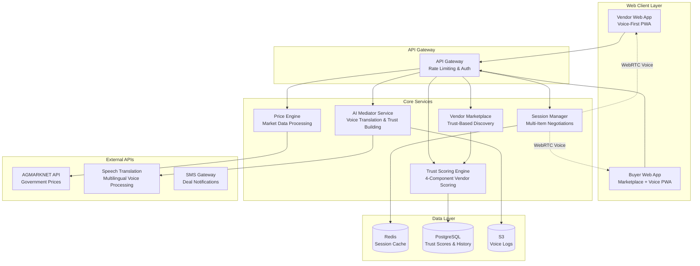

# Design Document: AI Mandi Mediator

## Overview

The AI Mandi Mediator is a voice-first, multilingual digital marketplace that enables buyers to browse and select vendors based on comprehensive trust scores, then negotiate multiple items in AI-mediated sessions. The system combines advanced vendor trust scoring, real-time voice translation, AI-powered trust building, and future-oriented relationship advice to create lasting business partnerships between vendors and buyers in Indian agricultural markets.

The architecture follows a microservices pattern with real-time communication capabilities, delivered as a Progressive Web App (PWA) supporting voice-first interactions for all users while providing a vendor marketplace for informed decision-making. The web platform ensures universal accessibility across devices without requiring app store installations, with a focus on rapid 2-hour implementation of core features.

## Architecture

### High-Level Architecture



### Technology Stack

**Web Platform:**
- **Frontend Framework:** React with TypeScript for responsive web application
- **Real-time Communication:** WebRTC via simple-peer for browser-to-browser communication
- **State Management:** Zustand for lightweight state management
- **Local Storage:** IndexedDB via Dexie.js for offline data caching
- **Audio Processing:** Web Audio API with MediaRecorder for voice recording/playback
- **Mobile Optimization:** Progressive Web App (PWA) with responsive design
- **QR Code:** QR code generation and scanning via browser camera API

**Backend Services:**
- **Runtime:** Node.js with TypeScript
- **Framework:** Express.js with Socket.io for real-time events
- **WebRTC Signaling:** Simple-peer with custom signaling server
- **API Gateway:** Kong or AWS API Gateway
- **Container Orchestration:** Docker with Kubernetes

**Data Storage:**
- **Session Cache:** Redis for real-time session data
- **Persistent Storage:** PostgreSQL for user data and deal history
- **File Storage:** AWS S3 for audio logs and session recordings
- **Search Engine:** Elasticsearch for price data indexing

## Components and Interfaces

### Vendor Marketplace Service

**Responsibilities:**
- Display vendors sorted by trust score
- Provide vendor filtering by commodity, location, trust threshold
- Show detailed trust score breakdowns
- Handle vendor selection and session initiation

**Key Interfaces:**
```typescript
interface VendorMarketplace {
  getAvailableVendors(filters: VendorFilters): Promise<VendorListing[]>
  getVendorDetails(vendorId: string): Promise<VendorProfile>
  selectVendor(buyerId: string, vendorId: string): Promise<SessionInitiation>
  filterVendors(criteria: FilterCriteria): Promise<VendorListing[]>
}

interface VendorListing {
  id: string
  name: string
  trustScore: number
  confidenceLevel: 'Low' | 'Medium' | 'High'
  availableCommodities: string[]
  location: MandiLocation
  reputationSummary: string
  priceHonestyScore: number
  fulfillmentReliabilityScore: number
  negotiationStabilityScore: number
  languageReliabilityScore: number
}

interface VendorFilters {
  commodityType?: string
  location?: string
  minTrustScore?: number
  maxDistance?: number
}
```

### Advanced Trust Scoring Engine

**Responsibilities:**
- Calculate 4-component vendor trust scores
- Track behavioral patterns and score components
- Provide confidence indicators based on transaction history
- Generate trust score breakdowns and explanations

**Key Interfaces:**
```typescript
interface TrustScoringEngine {
  calculateTrustScore(vendorId: string): Promise<ComprehensiveTrustScore>
  updateScoreComponents(vendorId: string, transaction: TransactionData): Promise<void>
  getScoreBreakdown(vendorId: string): Promise<TrustScoreBreakdown>
  getConfidenceLevel(vendorId: string): Promise<ConfidenceIndicator>
}

interface ComprehensiveTrustScore {
  vendorId: string
  overallScore: number // 0-100
  priceHonestyScore: number // 35% weight
  fulfillmentReliabilityScore: number // 30% weight
  negotiationStabilityScore: number // 20% weight
  languageReliabilityScore: number // 15% weight
  confidenceLevel: 'Low' | 'Medium' | 'High'
  transactionCount: number
  lastUpdated: Date
}

interface TrustScoreBreakdown {
  priceHonesty: {
    score: number
    description: string
    recentTransactions: number
    averageDeviation: number
  }
  fulfillmentReliability: {
    score: number
    description: string
    onTimeDeliveryRate: number
    quantityAccuracy: number
  }
  negotiationStability: {
    score: number
    description: string
    priceVolatility: number
    abandonedDeals: number
  }
  languageReliability: {
    score: number
    description: string
    translationDisputes: number
    multilingualSuccess: number
  }
}
```

### Session Manager Service

**Responsibilities:**
- Create and manage multi-item negotiation sessions
- Handle vendor selection and session initiation
- Maintain session state for multiple commodities
- Manage voice-based WebRTC connections

**Key Interfaces:**
```typescript
interface SessionManager {
  initiateSession(buyerId: string, vendorId: string): Promise<MultiItemSession>
  addItemToSession(sessionId: string, commodity: CommodityInfo): Promise<void>
  acceptSession(sessionId: string, vendorId: string): Promise<SessionJoinResult>
  terminateSession(sessionId: string, reason: string): Promise<void>
  getSessionState(sessionId: string): Promise<MultiItemSessionState>
}

interface MultiItemSession {
  id: string
  buyerId: string
  vendorId: string
  items: NegotiationItem[]
  status: 'pending' | 'active' | 'completed' | 'terminated'
  voiceChannelActive: boolean
  createdAt: Date
  expiresAt: Date
}

interface NegotiationItem {
  commodity: CommodityInfo
  quantity?: number
  proposedPrice?: number
  agreedPrice?: number
  status: 'pending' | 'negotiating' | 'agreed' | 'rejected'
}
```

### AI Mediator Service

**Responsibilities:**
- Process real-time voice translation in multiple Indian languages
- Actively build trust and guide negotiations
- Provide future-oriented relationship advice
- Detect emotional tone and intervene when needed

**Key Interfaces:**
```typescript
interface AIMediatorService {
  translateVoiceMessage(audio: AudioBuffer, targetLanguage: string): Promise<VoiceTranslation>
  buildTrustIntroduction(vendor: VendorProfile, buyer: BuyerProfile): Promise<IntroductionMessage>
  suggestCompromise(disagreement: DisagreementContext): Promise<CompromiseSuggestion>
  provideFutureInsights(completedDeal: DealTerms): Promise<FutureAdvice>
  detectEmotionalTone(voiceData: AudioBuffer): Promise<EmotionalAnalysis>
}

interface VoiceTranslation {
  originalAudio: string // S3 URL
  translatedAudio: string // S3 URL
  originalText: string
  translatedText: string
  confidence: number
  culturalContext?: string
  emotionalTone: 'calm' | 'excited' | 'frustrated' | 'respectful'
}

interface IntroductionMessage {
  vendorIntro: string
  buyerIntro: string
  trustHighlights: string[]
  successStories: string[]
  voiceMessage: string // S3 URL
}

interface FutureAdvice {
  marketOpportunities: string[]
  seasonalRecommendations: string[]
  relationshipTips: string[]
  nextSteps: string[]
  voiceAdvice: string // S3 URL
}
```

### Price Truth Engine

**Responsibilities:**
- Fetch and process government mandi price data
- Integrate crowd-sourced pricing information
- Calculate fair price bands with confidence intervals
- Provide location-specific market intelligence

**Key Interfaces:**
```typescript
interface PriceTruthEngine {
  getCurrentPrices(commodity: string, location: string): Promise<PriceData>
  getFairPriceBand(commodity: string, location: string): Promise<PriceBand>
  validatePriceOffer(offer: PriceOffer, marketData: PriceData): Promise<PriceValidation>
  getMarketTrends(commodity: string, location: string, days: number): Promise<TrendData>
}

interface PriceData {
  commodity: string
  location: string
  minPrice: number
  maxPrice: number
  modalPrice: number
  lastUpdated: Date
  source: 'government' | 'crowd' | 'hybrid'
  confidence: number
}

interface PriceBand {
  fair_min: number
  fair_max: number
  exploitation_threshold: number
  premium_threshold: number
  currency: 'INR'
  unit: string
}
```

### Cultural Negotiation Intelligence

**Responsibilities:**
- Preserve cultural context during translation
- Adapt communication styles for different regions
- Handle code-switching between languages
- Maintain respectful tone regardless of input

**Key Interfaces:**
```typescript
interface CulturalNegotiationIntelligence {
  translateWithContext(
    text: string, 
    sourceLanguage: string, 
    targetLanguage: string,
    culturalContext: CulturalContext
  ): Promise<ContextualTranslation>
  
  detectTone(audioData: ArrayBuffer, language: string): Promise<ToneAnalysis>
  adjustToneForCulture(message: string, targetCulture: string): Promise<string>
  handleCodeSwitching(mixedLanguageText: string): Promise<LanguageSegmentation>
}

interface CulturalContext {
  region: string
  negotiationStyle: 'direct' | 'indirect' | 'relationship_first'
  formalityLevel: 'formal' | 'informal' | 'respectful'
  powerDistance: 'high' | 'low'
}

interface ContextualTranslation {
  translatedText: string
  culturalNotes?: string
  alternativePhrasings?: string[]
  respectLevel: 'maintained' | 'enhanced' | 'adjusted'
}
```

### Reputation System

**Responsibilities:**
- Track deal completion rates and fairness scores
- Calculate trust metrics for market participants
- Apply penalties for exploitation behavior
- Generate reputation passports with privacy protection

**Key Interfaces:**
```typescript
interface ReputationSystem {
  updateScore(userId: string, event: ReputationEvent): Promise<void>
  getReputationScore(userId: string): Promise<ReputationScore>
  recordDealCompletion(sessionId: string, dealTerms: DealTerms): Promise<void>
  applyPenalty(userId: string, violation: ViolationType, severity: number): Promise<void>
}

interface ReputationScore {
  userId: string
  overallScore: number // 0-100
  dealCompletionRate: number
  fairnessScore: number
  trustLevel: 'new' | 'bronze' | 'silver' | 'gold' | 'platinum'
  totalDeals: number
  lastUpdated: Date
}

interface ReputationEvent {
  type: 'deal_completed' | 'fair_offer' | 'exploitation_detected' | 'session_abandoned'
  impact: number // -10 to +10
  metadata: Record<string, any>
}
```

## Data Models

### Core Entities

```typescript
// User Models
interface Vendor {
  id: string
  phoneNumber: string
  name: string
  preferredLanguage: string
  location: MandiLocation
  specializations: string[] // crop types
  trustScore: ComprehensiveTrustScore
  availableCommodities: CommodityInfo[]
  voiceProfile?: VoiceProfile
  isOnline: boolean
  createdAt: Date
}

interface Buyer {
  id: string
  phoneNumber: string
  businessName?: string
  preferredLanguages: string[]
  operatingRegions: MandiLocation[]
  trustScore: ComprehensiveTrustScore
  purchaseHistory: PurchaseRecord[]
  createdAt: Date
}

// Session Models
interface MultiItemNegotiationSession {
  id: string
  buyerId: string
  vendorId: string
  items: NegotiationItem[]
  location: MandiLocation
  status: SessionStatus
  voiceMessages: VoiceMessage[]
  priceOffers: PriceOffer[]
  aiInterventions: AIIntervention[]
  finalDeals: DealTerms[]
  trustBuildingEvents: TrustEvent[]
  createdAt: Date
  updatedAt: Date
  completedAt?: Date
}

interface VoiceMessage {
  id: string
  sessionId: string
  senderId: string
  senderType: 'vendor' | 'buyer' | 'ai_mediator'
  originalAudio: string // S3 URL
  translatedAudio?: string // S3 URL
  originalText: string
  translatedText?: string
  language: string
  targetLanguage?: string
  emotionalTone: EmotionalTone
  timestamp: Date
  translationConfidence?: number
}

// Trust Scoring Models
interface TrustScoreComponents {
  priceHonestyScore: number // 0-1, 35% weight
  fulfillmentReliabilityScore: number // 0-1, 30% weight
  negotiationStabilityScore: number // 0-1, 20% weight
  languageReliabilityScore: number // 0-1, 15% weight
}

interface TrustTransaction {
  id: string
  vendorId: string
  buyerId: string
  sessionId: string
  priceDeviation: number
  quantityAccuracy: number
  deliveryTimeliness: boolean
  negotiationVolatility: number
  languageDisputes: boolean
  completedSuccessfully: boolean
  timestamp: Date
}

// Market Data Models
interface CommodityInfo {
  name: string
  variety?: string
  grade?: string
  unit: 'kg' | 'quintal' | 'ton'
  seasonality: SeasonInfo
  currentMarketPrice?: PriceData
}

interface MandiLocation {
  state: string
  district: string
  mandiName: string
  coordinates: {
    latitude: number
    longitude: number
  }
  marketCode: string // AGMARKNET code
}

// Deal Models
interface DealTerms {
  commodity: CommodityInfo
  quantity: number
  agreedPrice: number
  totalValue: number
  paymentTerms: string
  deliveryTerms: string
  qualitySpecs?: string
  futureOpportunities?: string[]
  relationshipAdvice?: string[]
  timestamp: Date
}

interface PriceOffer {
  id: string
  sessionId: string
  itemId: string
  offeredBy: 'vendor' | 'buyer'
  pricePerUnit: number
  quantity: number
  conditions?: string
  timestamp: Date
  status: 'pending' | 'accepted' | 'rejected' | 'countered'
  aiAnalysis?: PriceAnalysis
}
```

### Supporting Models

```typescript
interface VoiceProfile {
  userId: string
  language: string
  accent: string
  speakingRate: number
  voicePrint?: string // for speaker identification
  calibrationComplete: boolean
  supportedLanguages: string[]
}

interface AIIntervention {
  id: string
  sessionId: string
  type: 'trust_building' | 'compromise_suggestion' | 'future_advice' | 'tone_adjustment' | 'cultural_clarification'
  message: string
  voiceMessage?: string // S3 URL
  targetAudience: 'vendor' | 'buyer' | 'both'
  timestamp: Date
  effectiveness?: number // post-intervention analysis
  trustImpact?: number // impact on trust building
}

interface TrustEvent {
  id: string
  sessionId: string
  type: 'positive_introduction' | 'successful_compromise' | 'fair_pricing' | 'respectful_communication'
  description: string
  participants: string[]
  trustScoreImpact: number
  timestamp: Date
}

interface EmotionalTone {
  primary: 'calm' | 'excited' | 'frustrated' | 'respectful' | 'aggressive' | 'friendly'
  intensity: number // 0-1
  confidence: number // 0-1
  culturalContext?: string
}

interface PriceAnalysis {
  fairnessScore: number // 0-1
  marketComparison: 'below_market' | 'fair_market' | 'above_market'
  deviationPercentage: number
  recommendation: string
  trustScoreImpact: number
}

interface FutureOpportunity {
  type: 'seasonal_crop' | 'market_expansion' | 'quality_upgrade' | 'bulk_discount'
  description: string
  timeframe: string
  potentialValue: number
  requirements: string[]
}

interface RelationshipAdvice {
  category: 'communication' | 'pricing' | 'delivery' | 'quality'
  advice: string
  expectedBenefit: string
  implementationSteps: string[]
}

interface MarketIntelligence {
  location: MandiLocation
  commodity: string
  currentTrends: TrendData
  seasonalPatterns: SeasonalData
  priceVolatility: number
  supplyDemandIndicators: SupplyDemandData
  futureProjections: FutureProjection[]
  lastUpdated: Date
}

interface ConfidenceIndicator {
  level: 'Low' | 'Medium' | 'High'
  transactionCount: number
  description: string
  threshold: {
    low: number // <10 transactions
    medium: number // 10-30 transactions
    high: number // >30 transactions
  }
}
```

## Error Handling

### Error Categories and Strategies

**Network and Connectivity Errors:**
- Implement exponential backoff for API calls
- Cache critical data (prices, translations) for offline operation
- Graceful degradation when external services are unavailable
- WebRTC fallback mechanisms for poor network conditions

**Translation and Speech Processing Errors:**
- Multiple translation service providers with failover
- Confidence scoring for translation quality
- Manual retry mechanisms for unclear audio
- Fallback to text input when voice processing fails

**Price Data and Market Intelligence Errors:**
- Stale data detection with clear user warnings
- Multiple data source aggregation for reliability
- Price validation against historical ranges
- Manual price override with justification logging

**Session Management Errors:**
- Automatic session recovery after network interruptions
- Participant reconnection handling
- Session state synchronization across devices
- Timeout handling with user notifications

### Error Response Patterns

```typescript
interface ErrorResponse {
  code: string
  message: string
  userMessage: LocalizedMessage
  severity: 'info' | 'warning' | 'error' | 'critical'
  recoveryActions: RecoveryAction[]
  timestamp: Date
}

interface RecoveryAction {
  type: 'retry' | 'fallback' | 'manual_input' | 'contact_support'
  description: LocalizedMessage
  actionData?: Record<string, any>
}

interface LocalizedMessage {
  [languageCode: string]: string
}
```

## Testing Strategy

The testing strategy employs a dual approach combining unit tests for specific scenarios and property-based tests for comprehensive validation of universal system behaviors.

### Unit Testing Focus Areas

**Specific Examples and Edge Cases:**
- Authentication flows with various phone number formats
- QR code generation and validation edge cases
- Price calculation with extreme market conditions
- Translation accuracy for specific cultural phrases
- Session timeout and cleanup scenarios

**Integration Points:**
- AGMARKNET API integration with mock responses
- WebRTC signaling server connection handling
- SMS gateway integration for deal notifications
- External translation service failover mechanisms

**Error Conditions:**
- Network failure during active negotiations
- Invalid audio input handling
- Malformed price data from external sources
- Session corruption and recovery scenarios

### Property-Based Testing Configuration

**Testing Framework:** 
- **Backend:** fast-check for TypeScript/Node.js services
- **Mobile:** Built-in property testing with Dart's test framework
- **Minimum Iterations:** 100 per property test to ensure statistical significance
- **Test Tagging:** Each property test tagged with format: **Feature: ai-mandi-mediator, Property {number}: {property_text}**

**Property Test Categories:**
- **Universal System Behaviors:** Properties that must hold across all valid inputs
- **Data Integrity:** Round-trip properties for serialization and translation
- **Business Logic Invariants:** Properties that ensure fair trading rules
- **Security Properties:** Properties that validate access control and data protection

The combination of unit tests and property-based tests ensures both concrete bug detection and comprehensive validation of system correctness across the vast input space of real-world agricultural negotiations.

## Correctness Properties

*A property is a characteristic or behavior that should hold true across all valid executions of a system—essentially, a formal statement about what the system should do. Properties serve as the bridge between human-readable specifications and machine-verifiable correctness guarantees.*

### Property 1: Vendor Marketplace Trust-Based Sorting
*For any* buyer accessing the vendor marketplace, the system should display available vendors sorted by trust score (highest first), show trust score components, confidence indicators, and available commodities for each vendor.
**Validates: Requirements 1.1, 1.2**

### Property 2: Vendor Selection and Session Initiation
*For any* vendor selection by a buyer, the system should display detailed trust score breakdown, allow confirmation of selection, and initiate a multi-item negotiation session with the chosen vendor.
**Validates: Requirements 1.3, 1.4**

### Property 3: Multi-Item Session Management
*For any* confirmed vendor selection, the system should create a multi-item negotiation session, allow both parties to add multiple commodities, provide real-time price data for each item, and generate comprehensive deal summaries.
**Validates: Requirements 2.1, 2.2, 2.3, 2.4, 2.5**

### Property 4: Advanced Trust Score Calculation
*For any* vendor, the system should calculate a composite trust score (0-100) using the weighted formula: 35% Price Honesty + 30% Fulfillment Reliability + 20% Negotiation Stability + 15% Language Reliability, with appropriate confidence indicators.
**Validates: Requirements 8.1, 8.6, 8.7**

### Property 5: Trust Score Component Accuracy
*For any* trust score calculation, each component should be computed correctly: PHS based on price deviation from fair bands, FRS based on delivery performance, NSS based on negotiation volatility, and LRS based on translation disputes.
**Validates: Requirements 8.2, 8.3, 8.4, 8.5**

### Property 6: Voice-First Multilingual Communication
*For any* voice input in supported languages (Hindi, English, Tamil, Telugu, Marathi, Gujarati, Punjabi, Bengali, Kannada), the system should provide real-time voice translation, detect emotional tone, and maintain respectful communication.
**Validates: Requirements 4.1, 4.2, 4.4, 4.5**

### Property 7: AI Trust Building and Intervention
*For any* negotiation session, the AI should introduce parties with positive reputation highlights, suggest compromises during disagreements, provide market context for pricing, and share success stories to build confidence.
**Validates: Requirements 5.1, 5.2, 5.3, 5.4**

### Property 8: Future-Oriented Relationship Advice
*For any* completed deal, the system should provide personalized market opportunity advice, seasonal recommendations, relationship-building tips, and connect successful trading partners for future collaboration.
**Validates: Requirements 6.1, 6.2, 6.4, 6.5**

### Property 9: Comprehensive Deal Documentation
*For any* completed multi-item deal, the system should generate deal summaries in both parties' languages, include all required information, deliver via SMS and app notification, and store for 90 days.
**Validates: Requirements 7.1, 7.2, 7.3, 7.4, 7.5**

### Property 10: Trust Score Visual Display
*For any* trust score presentation, the system should use clear visual indicators (colors, stars, progress bars), show confidence levels, and be easily understood by users with minimal tech literacy.
**Validates: Requirements 8.8**

### Property 11: Location-Based Market Intelligence
*For any* user location, the system should detect GPS coordinates, prioritize local mandi pricing data, fall back to regional data with disclaimers when local data is insufficient, and display location-relevant market trends.
**Validates: Requirements 9.1, 9.2, 9.3, 9.4, 9.5**

### Property 12: Rapid Implementation Core Features
*For any* system deployment, the core features (voice input/output, real-time translation, basic price display, trust-building phrases, multi-item negotiations) should be prioritized with mock data and 2-3 supported languages for rapid development.
**Validates: Requirements 11.1, 11.2, 11.3, 11.4, 11.5**

### Property 13: Security and Privacy Protection
*For any* communication or data handling, the system should encrypt all session communications, minimize stored personal information, purge temporary data while preserving anonymized statistics, and require explicit consent for data sharing.
**Validates: Requirements 12.1, 12.2, 12.3, 12.4, 12.5**