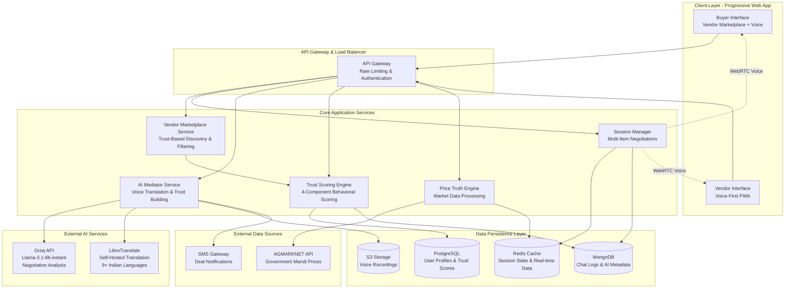
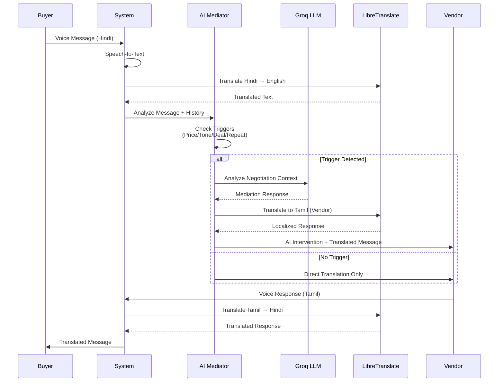
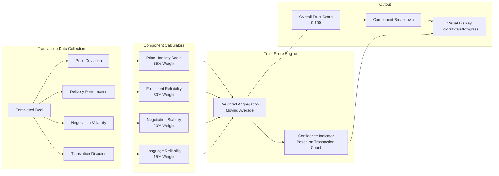
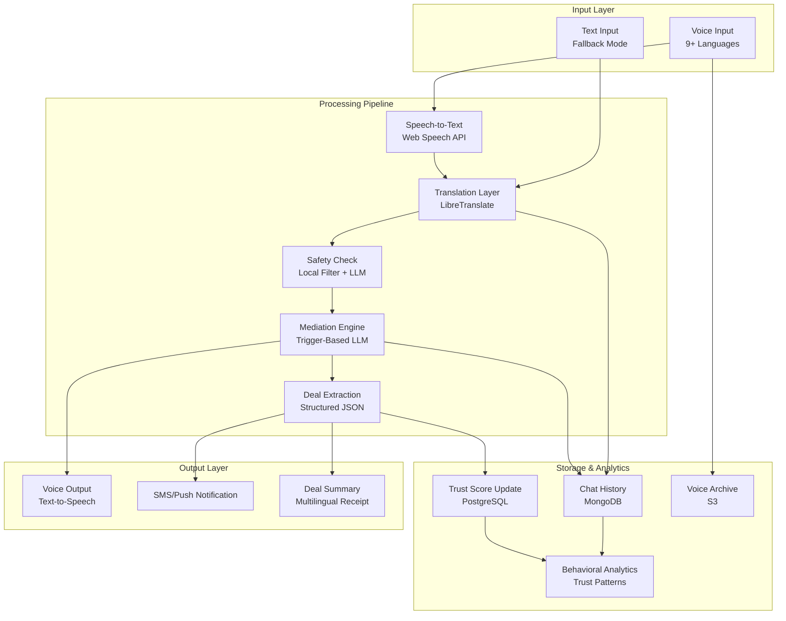
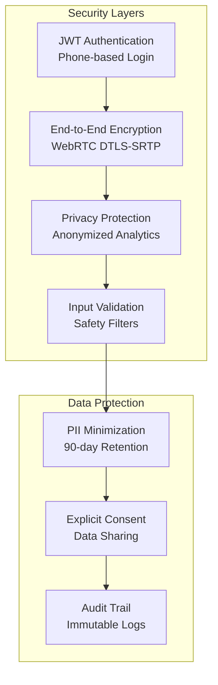
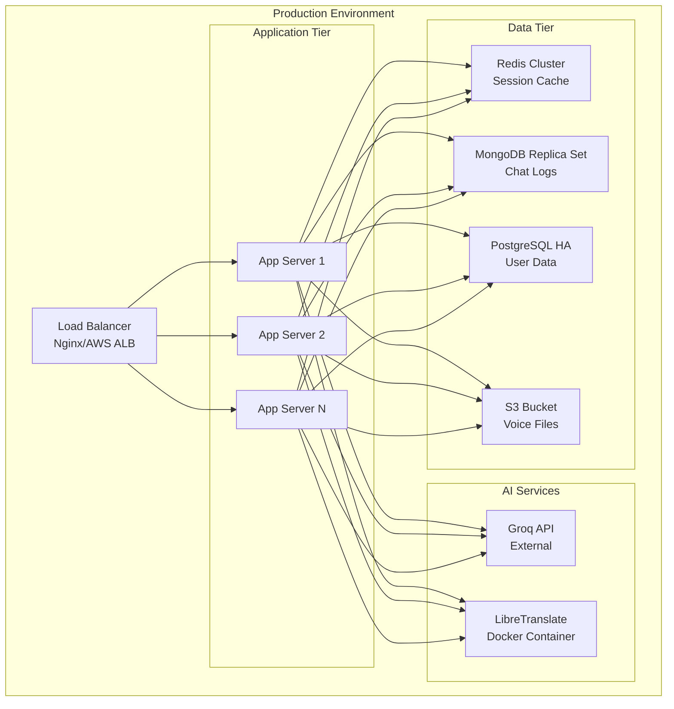

# DharmaVyāpaara - Solution Architecture

## High-Level System Architecture

## AI Mediation Flow

## Trust Scoring Architecture

## Data Flow Architecture

## Technology Stack Details

### Frontend
- **Framework**: React 19 with TypeScript
- **State Management**: Zustand
- **Real-time**: Socket.io Client, WebRTC (simple-peer)
- **Voice**: Web Audio API, MediaRecorder
- **Offline**: IndexedDB (Dexie.js), Service Workers
- **UI**: Tailwind CSS, Responsive PWA

### Backend
- **Runtime**: Node.js with TypeScript
- **Framework**: Express.js
- **Real-time**: Socket.io Server
- **Authentication**: JWT
- **File Upload**: Multer

### AI & Translation
- **LLM**: Groq API (Llama-3.1-8b-instant)
- **Translation**: LibreTranslate (Self-hosted)
- **Speech**: Web Speech API (Browser-native)

### Data Storage
- **Session Cache**: Redis
- **Chat Logs**: MongoDB
- **User Data**: PostgreSQL (proposed)
- **Voice Files**: AWS S3 / Local Storage

### External APIs
- **Price Data**: AGMARKNET (data.gov.in)
- **Notifications**: SMS Gateway
- **Maps**: GPS/Location Services

## Security Architecture

## Deployment Architecture

## Key Architectural Decisions

### 1. State-Machine Driven Mediation
- **Decision**: Use trigger-based LLM activation instead of processing every message
- **Rationale**: Reduces API costs by 70%, improves latency, maintains responsiveness
- **Implementation**: Regex/keyword detection for price mentions, tone shifts, deal signals

### 2. Separation of Extraction and Mediation
- **Decision**: Split deal extraction (JSON) from response generation
- **Rationale**: Reduces hallucination, ensures database accuracy matches AI congratulations
- **Implementation**: Two separate LLM calls with different prompts and validation

### 3. Self-Hosted Translation
- **Decision**: Deploy LibreTranslate instead of using cloud translation APIs
- **Rationale**: Cost control, data privacy, offline capability, no vendor lock-in
- **Implementation**: Docker container with language models, fallback to scripted heuristics

### 4. Behavioral Trust Scoring
- **Decision**: Calculate trust from actual transaction behavior, not user ratings
- **Rationale**: Objective, manipulation-resistant, culturally neutral
- **Implementation**: 4-component weighted formula with moving averages

### 5. Progressive Web App
- **Decision**: Build PWA instead of native mobile apps
- **Rationale**: Universal accessibility, no app store friction, instant updates
- **Implementation**: Service workers, IndexedDB, responsive design

## Scalability Considerations

- **Horizontal Scaling**: Stateless application servers behind load balancer
- **Caching Strategy**: Redis for session data, CDN for static assets
- **Database Sharding**: MongoDB sharded by location, PostgreSQL read replicas
- **Async Processing**: Queue-based architecture for non-critical operations
- **CDN**: CloudFront/Cloudflare for global voice file delivery
